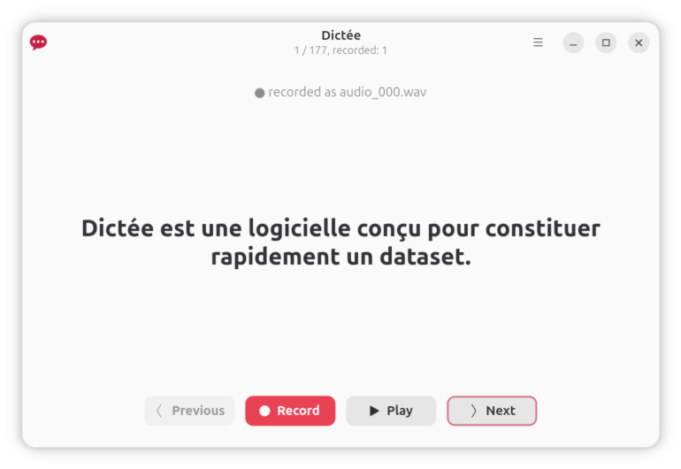

# Dictée


> **dictée** _f_ (plural dictées)
> dictée [\dik.te\] _féminin_
> French, dictation, the process of speaking for someone else to write down the words

A small Linux desktop app (GTK 4 + libadwaita, in Vala) to record an audio
dataset for training or fine-tuning speech-recognition models. Dictée walks
through a UTF-8 list of sentences, records each one from the microphone,
and produces matching WAV files plus a tab-separated transcript manifest.

## Install

```sh
curl -L -o /tmp/dictee.flatpak \
    https://github.com/benjaminbellamy/Dictee/releases/download/v1.0.0/dictee-1.0.0.flatpak \
    && flatpak install --user --bundle /tmp/dictee.flatpak
```

Run it:

```sh
flatpak run fr.benjaminbellamy.dictee path/to/sentences.txt
```

See the [releases page](https://github.com/benjaminbellamy/Dictee/releases) for all versions.



## Audio format produced

Every WAV on disk is **16-bit signed PCM, mono, 16 000 Hz**
(`audio/x-raw,format=S16LE,rate=16000,channels=1`). This is the dataset
target and never changes — but it's not what we *capture* at.

## Capture architecture

Internally, capture and all DSP run at **32-bit float / 32 kHz**:

```
{pipewiresrc | pulsesrc} ! audioconvert ! audioresample
                         ! F32LE / 32 kHz / mono caps
                         ! appsink
```

The capture pipeline runs continuously for the whole app session, so the
microphone-startup transient (preamp settling, USB-mic boot, AGC
stabilisation) happens **once**, at app launch, while you're opening the
sentences file — not on every recording.

Pressing **Record** only sets a flag that starts appending samples to an
in-memory buffer; pressing **Stop** does all the post-processing in
float, then quantises and downsamples in a single step at write time.
This is the standard "process at high precision, quantize once at the
end" mastering workflow.

Two cropping knobs in `src/recorder.vala` swallow the residual key-press
clicks of pressing Record and Stop on the keyboard:

- `CROP_START_DELAY_MS` — drop this much audio after Record (default 0)
- `CROP_STOP_DELAY_MS` — drop this much audio before Stop (default 0)

Tune them once you measure how long the press of each key takes to reach
your mic.

After cropping, the float buffer is normalised in place by
`Normalize.in_place_f32` (`src/normalize.vala`):

1. The DC offset is removed so the signal is centred on zero.
2. Samples are peak-normalised to **-1 dBFS** for clip-to-clip loudness
   consistency without touching dynamics.
3. A 15 ms linear fade-in/out is applied so the first/last sample is
   exactly zero.
4. Samples are defensively clamped to `[-1.0, 1.0]`.

The processed float buffer is then handed to a short-lived second
GStreamer pipeline:

```
appsrc(F32LE/32 kHz) ! audioconvert ! audioresample
                     ! S16LE / 16 kHz / mono caps
                     ! wavenc ! filesink
```

`audioresample` does the 2:1 downsample with its anti-alias filter, and
`audioconvert` does the float → int16 quantisation with TPDF dither.
The output WAV is exactly the dataset format spec. Target dBFS and fade
length are constants at the top of `src/normalize.vala`; the capture and
output rates are constants in `src/recorder.vala`.

## Sentences file

A plain-text UTF-8 file with one sentence per line:

```
The quick brown fox jumps over the lazy dog.
Portez ce vieux whisky au juge blond qui fume.
…
```

Blank lines are ignored (they do not consume an index). Trailing whitespace
on each line is stripped.

## Output layout

For a sentences file `foo.txt` of N lines, by default Dictée creates a
sibling folder `foo/` next to it (named after the file with the extension
stripped) and writes:

```
foo/audio_00.wav      # padded to max(2, digits-in-N)
foo/audio_01.wav
…
foo/audio_<N-1>.wav
foo/trans.txt         # audio_NN.wav<TAB>sentence per recorded line
```

The folder is created on demand. You can override it from the menu;
opening a different sentences file re-derives the default.

**The `audio_*.wav` files together with `trans.txt` form the dataset —
audio plus paired transcript — ready to feed into a speech-recognition
training pipeline.**

## Resume behavior

On launch, Dictée scans the output directory and opens at the first
sentence whose `audio_NN.wav` does not yet exist. If every sentence has
been recorded already, it opens at index 0 so you can review or re-record.

The manifest is treated as a generated artifact: it is rewritten from
scratch after every successful recording (and once at launch) by scanning
the on-disk WAV files. A truncated or stale `trans.txt` self-heals on next
launch.

## Keyboard

Dictée is designed to be driven entirely from the keyboard.

- **Tab / Shift+Tab** — move keyboard focus between the four buttons
  (Previous, Record, Play, Next). The button row is homogeneous-width so
  Record/Stop stay the same size when the label swaps.
- **Enter** (or **Space**) — activate the focused button.
- **←** / **→** — previous / next sentence (equivalent to activating
  Previous / Next).
- **P** — play the current recording.

After a sentences file is loaded, focus lands on **Record**. The focus
ring is forced visible so you always see which button is selected. Focus
then follows these rules as you work:

| You activate    | Next focus lands on                                       |
| --------------- | --------------------------------------------------------- |
| **Record**      | Same button (it has just become Stop).                    |
| **Stop**        | **Next** — so you can jump straight to the next sentence. |
| **Next**        | **Next** normally; **Record** if you just hit Stop.       |
| **Previous**    | **Play** — so you can verify what you went back to.       |
| **Previous** *after* Previous | **Previous** — you're navigating backwards. |
| **Play**        | Same button.                                              |

With the default workflow Record → Stop → Next → Record → Stop → Next …
you never leave the keyboard.

## Build and run locally (Meson)

System packages needed (names are Debian/Ubuntu-ish; adjust for your
distro): `meson`, `ninja-build`, `valac`, `libgtk-4-dev`,
`libadwaita-1-dev`, `libgstreamer1.0-dev`,
`libgstreamer-plugins-base1.0-dev` (for `Gst.App.Sink`),
`gstreamer1.0-plugins-base`, `gstreamer1.0-plugins-good`,
`gstreamer1.0-pulseaudio` and/or `gstreamer1.0-pipewire`.

```sh
meson setup build
meson compile -C build
./build/src/dictee path/to/sentences.txt
```

## Build and install the Flatpak

```sh
flatpak install --user flathub org.gnome.Platform//49 org.gnome.Sdk//49
flatpak-builder --user --install --force-clean \
    build-flatpak fr.benjaminbellamy.dictee.yml
flatpak run fr.benjaminbellamy.dictee path/to/sentences.txt
```

The Flatpak finish-args grant:

- `--socket=wayland`, `--socket=fallback-x11`, `--share=ipc` — display
- `--socket=pulseaudio` — microphone capture and playback via PipeWire's
  PulseAudio compatibility layer
- `--filesystem=home` — needed because the app reads the sentences file
  and writes the WAV/manifest files outside its sandbox. A stricter setup
  could rely on the XDG file portal instead and drop the broad home
  permission; this app keeps it simple.

The recorder tries `pipewiresrc` first and falls back to `pulsesrc`
whenever the first source can't enter PLAYING — whether because the plugin
is missing or because the sandbox can only reach the PulseAudio socket
(the default with `--socket=pulseaudio`). The rest of the pipeline is
unchanged either way.

## Verifying the audio format

After recording one or more lines (assuming `sentences.txt` next to the
output folder `sentences/`):

```sh
file sentences/audio_00.wav
# → RIFF (little-endian) data, WAVE audio, Microsoft PCM, 16 bit, mono 16000 Hz

soxi sentences/audio_00.wav           # if sox is installed
```

## License

GPL-3.0-or-later. See [LICENSE](LICENSE).
